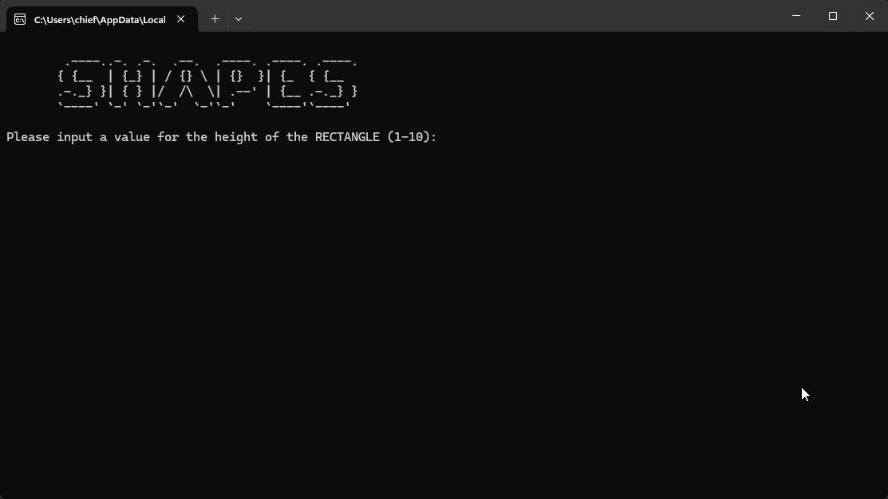

# Shape Display Program

This Python program allows users to display different shapes (rectangle, triangle, and pyramid) with customized sizes, as well as ASCII art. The program includes basic input validation to ensure correct size inputs and displays shapes accordingly.

## 🛠️ Features

- **Rectangle**: User inputs the height (1-10) and the program prints a rectangle with a fixed width of 16.
- **Triangle**: User inputs the number of rows (1-10) and the program prints a right-angled triangle.
- **Pyramid**: User inputs the number of levels (1-10) and the program prints a pyramid with a symmetrical shape.
- **ASCII Art**: Displays a fun ASCII art logo at the start.

## ⚙️ How to Run

1. Ensure Python 3 is installed on your system.
2. Download or clone the repository.
3. Save the file as `shape_display.py`.
4. Run the script using:

```bash
python shape_display.py
```

OR
1. Open the `.sln` (Visual Studio Solution) file in **Microsoft Visual Studio**
2. Press `Ctrl + F5` or click **Run** to execute the program

## 🧠 Educational Insights

- User input validation and error handling
- Looping techniques (both `for` and `while` loops)
- String manipulation for ASCII art

## 📺 Demo Output


